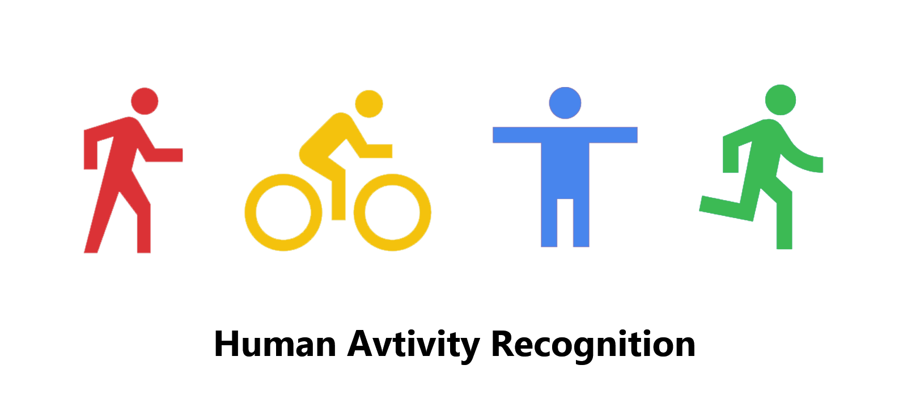
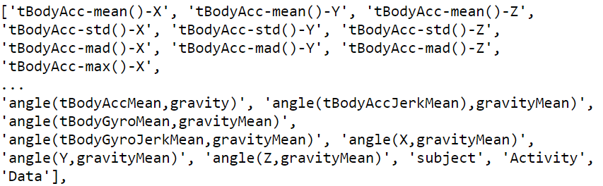

<!-- PROJECT TITLE -->
<h1 align="center">Human Activity Recognition</h1>

<!-- HEADER -->
<p align="center">
  
</p>

<!-- PROJECT DESCRIPTION -->
## <br>**➲ Project description**
Human activity recognition is the problem of classifying sequences of data
recorded by specialized harnesses or smart phones into known well-defined Human activities,
The problem will be solved using K-Nearest-Neighbor (KNN) algorithm where we will train the model on dataset of collection of 
human activities in order to classifying it.

<!-- PREREQUISTIES -->
## <br>**➲ Prerequisites**
This is list of required packages and modules for the project to be installed :
* <a href="https://www.python.org/downloads/" target="_blank">Python 3.x</a>
* Pandas 
* Numpy
* Seaborn
* Matplotlib
* Scikit-learn

Install all required packages :
 ```sh
  pip install -r requirements.txt
  ```

<!-- THE DATASET -->
## <br>**➲ The Dataset**
Human activites dataset contain about 564 columns to describe human current activity<br>
and a target column which describe what's the current state of a human.
<br>**Dataset features and target :**


<!-- CODING SECTIONS -->
## <br>**➲ Coding Sections**
In this part we will see the project code divided to sections as follows:
<br>

- Section 1 | Data Preprocessing :<br>
In this section we aim to do some operations on the dataset before training the model on it,
<br>processes like loading dataset, check missing values and dataset statistics.
<br>then we visualize some dataset columns in order to have some insights for better understanding, and apply dimensionality reduction using PCA algorithm in order to transform the data from a high-dimensional space into a low-dimensional space.
<br>Finally we scale the dataset and split it into training and testing sets<br>

- Section 2 | Model Creation :<br>
The dataset is ready for training, so we create a K-nearest Neighbors "KNN" model using scikit-learn and thin fit it to the data.<br>

- Section 3 | Model Evaluation :<br>
Finally we evaluate the model by getting accuracy, classification report and confusion matrix.

<!-- INSTALLATION -->
## <br>**➲ Installation**
1. Clone the repo
   ```sh
   git clone https://github.com/omaarelsherif/Human-Activity-Recognition-Using-Machine-Learning.git
   ```
2. Run the code from cmd
   ```sh
   python human_activity_recognation.py
   ```

<!-- OUTPUT -->
## <br>**➲ Output**
Now let's see the project output after running customer_churn.py :

**Dataset head :**<br>
<br><br>

**Dataset statistics :**<br>
<br><br>

**Activites :**<br>
<br><br>

**Accuracy and classification report :**<br>
<br><br>

**Model confusion matrix :**<br>
<br><br>

<!-- REFERENCES -->
## <br>**➲ References**
These links may help you to better understanding of the project idea and techniques used :
1. Human Activity Recognition research : https://bit.ly/384uASG
2. Models for Human Activity Recognition : https://bit.ly/3zhW57a
3. Standard Scaler : https://bit.ly/3mt2r04
4. Principal Component Analysis (PCA) : https://bit.ly/3knqZVD
5. K-Nearest Neighbors (KNN) : https://bit.ly/2XI2Ukq
6. Model evaluation : https://bit.ly/3B12VOO

<!-- CONTACT -->
## <br>**➲ Contact**
- E-mail   : [omaarelsherif@gmail.com](mailto:omaarelsherif@gmail.com)
- LinkedIn : https://www.linkedin.com/in/omaarelsherif/
- Facebook : https://www.facebook.com/omaarelshereif
